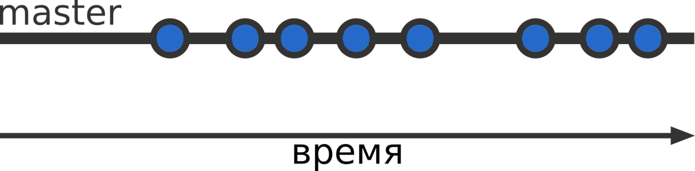
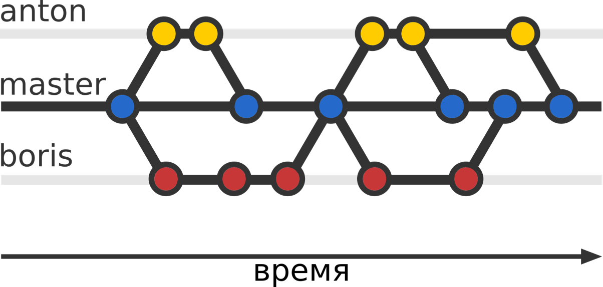
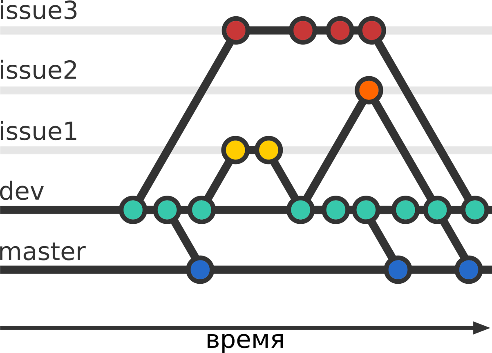
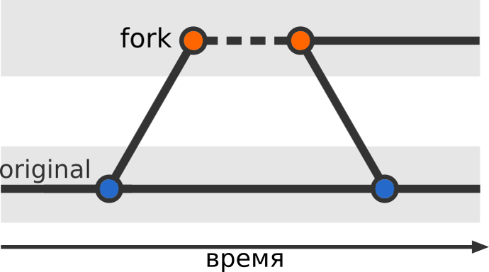

# 5. Методологии ветвления

LICENSE: [MIT](./license.md)

GIT logo by Jason Long - <http://git-scm.com/downloads/logos>, license: [CC BY 3.0](https://creativecommons.org/licenses/by/3.0)

---
### Содержание:

1. [Central Workflow](./branch_methods.md#central)
2. [Developer Branch Workflow](./branch_methods.md#dev)
3. [Feature Branch Workflow](./branch_methods.md#feature)
4. [Issue Branch Workflow](./branch_methods.md#issue)
5. [Forking Workflow](./branch_methods.md#forking)

### 	Central Workflow

Репозиторий содержит только одну главную ветку master. Все изменения комитятся в нее. Репозиторий может быть как локальным, так и удаленным.

Данный метод подходит для одиночного проекта. Разработчик сможет отслеживать все изменения, и при необходимости вернуться к предыдущей 

---

### 	Developer Branch Workflow

У каждого разработчика своя ветка, в которую он вносит изменения. В конечном итоге все изменения вливаются в основную ветку проекта

Больше подойдет для небольшого проекта с ограниченным количеством требований и небольшим количеством разработчиков. Наиболее вероятный сценарий для группового учебного проекта, когда каждый участник делает свою часть, а затем публикует её в удаленном репозитории для того, чтобы остальные её увидели до того, как она будет слита.

---

### 	Feature Branch Workflow

Репозиторий имеет дополнительную ветку, в которой находится стабильный код для отправки пользователям. Новые функции начинают свой код от этой ветки, и сливаются с ней же.

Этот метод подходит командам, которые используют какой-то метод управления проектами.

---

### 	Issue Branch Workflow

Схема работы схожа с [Feature Branch Workflow](#feature), однако разделение идёт не по новым функциям, а по задачам перед разработчиками

Этот метод подходит командам, которые используют какой-то метод управления проектами.

---

### 	Forking Workflow

Существует два репозитория:

- оригинальный
- форк репозитория: копия оригинального репозитория во владении другого разработчика, который хочет внести изменения

Данный метод подходит проектам с открытым исходным кодом: каждый разработчик может добавить новую функцию и предложить внести её в основнуюю часть владельцу репозитория

---
[прошлая глава](./branch.md) | [на главную](./README.md) | [следующая глава](./conflicts.md)