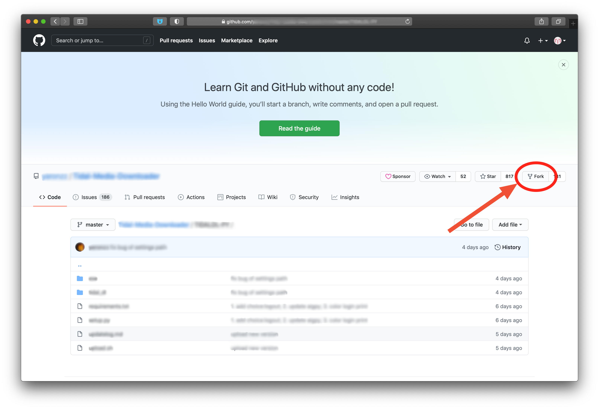
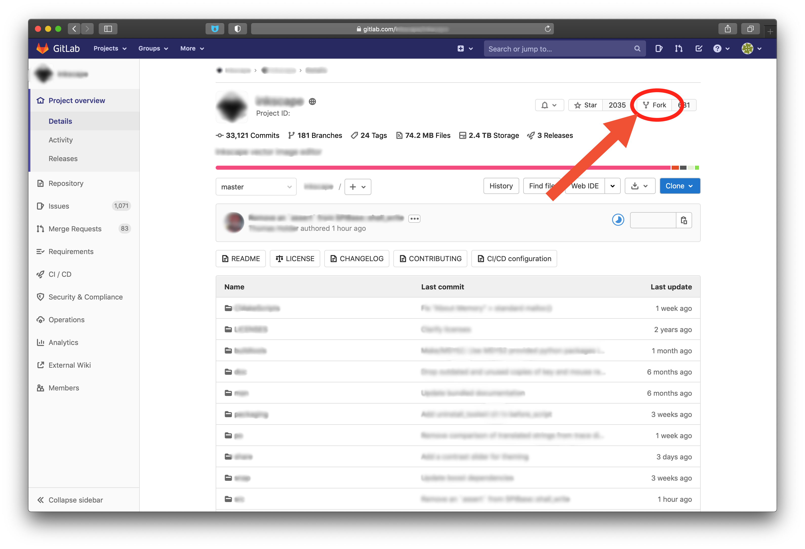

# 7. Форк

LICENSE: [MIT](./license.md)

GIT logo by Jason Long - <http://git-scm.com/downloads/logos>, license: [CC BY 3.0](https://creativecommons.org/licenses/by/3.0)

---

Иногда возникает необходимость использовать сторонний проект для старта своего. Или же есть желание помочь проекту, добавлением в него новых функций. В данном случае можно создать *форк* - личную версию стороннего проекта.

Форк сохраняет связь с проектом-родителем, по которой он может получить изменения из проекта-родителя

Многие хостинги IT-проектов реализуют возможность форков в своём интерфейсе.

---
[прошлая глава](./conflicts.md) | [на главную](./README.md) | [следующая глава](./github.md)