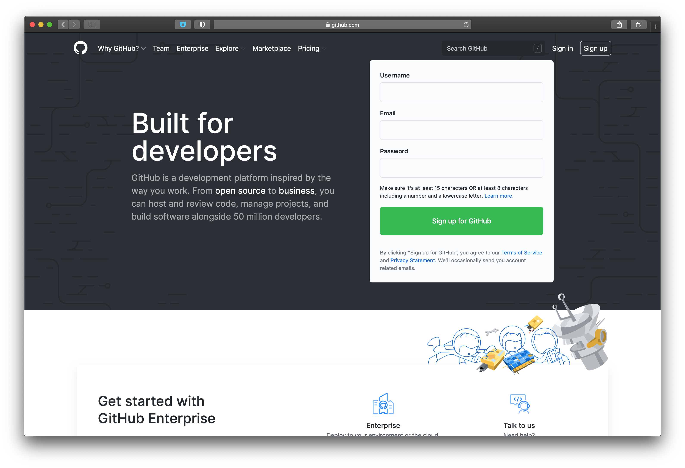

# 8. Работа с GitHub <svg class="octicon octicon-mark-github v-align-middle" height="32" viewBox="0 0 16 16" version="1.1" width="32" aria-hidden="true"><path fill-rule="evenodd" d="M8 0C3.58 0 0 3.58 0 8c0 3.54 2.29 6.53 5.47 7.59.4.07.55-.17.55-.38 0-.19-.01-.82-.01-1.49-2.01.37-2.53-.49-2.69-.94-.09-.23-.48-.94-.82-1.13-.28-.15-.68-.52-.01-.53.63-.01 1.08.58 1.23.82.72 1.21 1.87.87 2.33.66.07-.52.28-.87.51-1.07-1.78-.2-3.64-.89-3.64-3.95 0-.87.31-1.59.82-2.15-.08-.2-.36-1.02.08-2.12 0 0 .67-.21 2.2.82.64-.18 1.32-.27 2-.27.68 0 1.36.09 2 .27 1.53-1.04 2.2-.82 2.2-.82.44 1.1.16 1.92.08 2.12.51.56.82 1.27.82 2.15 0 3.07-1.87 3.75-3.65 3.95.29.25.54.73.54 1.48 0 1.07-.01 1.93-.01 2.2 0 .21.15.46.55.38A8.013 8.013 0 0016 8c0-4.42-3.58-8-8-8z"></path></svg>

LICENSE: [MIT](./license.md)


GIT logo by Jason Long - <http://git-scm.com/downloads/logos>, license: [CC BY 3.0](https://creativecommons.org/licenses/by/3.0)

---

***GitHub*** является крупнейшим хостингом IT-проектов. Отличительная особенность GitHub - лёгкое создание форков.

>В возможностях этого IT-хостинга, за исключением возможностей системы контроля версий, есть:

>- Ведение документации (wiki) проекта,
>- Трекинг задач (issues),
>- Приём пожертвований.

Небольшие проекты и проекты с открытым исходным кодом имеют те же возможности на GitHub, что и крупные коммерческие проекты, но для них использование хостинга бесплатно.

### Регистрация

Для регистрации переходим на сайт [GitHub](https://github.com). Окно для начала регистрации находится сразу на главной странице


### Репозитории

После входа в аккаунт в левой части появятся ваши репозитории. Там же находится кнопка создания нового репозитория


После создания удаленного репозитория свяжите проект с ним.

- переходим в папку проекта
```
$ cd /path/to/project
```
- создаём локальный репозиторий командой
```
$ git init
```
- добавляем ссылку на удалённый репозиторий
```
$ git remote add origin <link_to_repository>
```
- загружаем файлы в удалённый репозиторий
```
# добавляем все файлы в индекс
$ git add -all

# делаем коммит
$ git commit -m "init commit"

# отправляем данные в удалённый репозиторий
$ git  push -u origin main
```

---
[прошлая глава](./fork.md) | [на главную](./README.md) | [следующая глава](./sources.md)